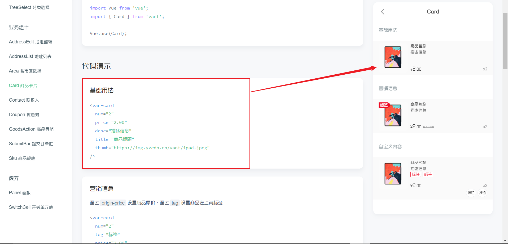

### 前端项目搭建

**【前端技术栈】**：**vue + Vant UI + less**

**1. Vue CLI创建项目**


**2. Vant UI 安装**

```shell
cnpm i vant -S
```

**3. less安装命令**

```shell
cnpm install less less-loader --save
```

**4. 项目启动测试**

```shell
npm run serve
```


### Vant构建首页

#### 商品标签

每款手机都有自己得属性，品牌，特点等。

**Card卡片标签显示这些属性，在循环中遍历自身的属性内容即可展示**

Card商品卡片

```js
<van-card
  num="2"
  price="2.00"
  desc="描述信息"
  title="商品标题"
  thumb="https://img.yzcdn.cn/vant/ipad.jpeg"
/>
```



tag商品属性

```js
<template #tags>
	<van-tag v-for="tag in item.tag" color="#f2826a" style="margin-left: 5px;">{{tag.name}}		</van-tag>
</template>
```

<br>

#### 顶部Tag切换

归结于目前手机同质化太严重，很多手机都外观差别不是很明显。标配全面屏 + 多摄像，所以从手机的大体的颜色来分类，对比不同厂商手机的价格。

```js
<van-tabs v-model="active">
  <van-tab title="标签 1">内容 1</van-tab>
  <van-tab title="标签 2">内容 2</van-tab>
  <van-tab title="标签 3">内容 3</van-tab>
  <van-tab title="标签 4">内容 4</van-tab>
</van-tabs>
export default {
  data() {
    return {
      active: 2,
    };
  },
};
```


分类信息存放，遍历`categories`数组


遍历获取动态数据

```js
<van-tab v-for="index in categories.length" :title="categories[index-1].name" class="tab">
  <van-card v-for="(item,index) in phones"
            :price="item.price"
            :desc="item.desc"
            :title="item.title"
            :thumb="item.thumb"
  >
    <template #tags>
      <van-tag v-for="tag in item.tag" color="#f2826a" style="margin-left: 5px;">{{tag.name}}</van-tag>
    </template>
    <template #footer>
      <van-button round type="info" size="mini" @click="buy(index)">购买</van-button>
    </template>
  </van-card>
</van-tab>
```

**绑定点击事件**

在当前Title上绑定点击事件

```js
<van-tabs @click="onClick">
```

<br>

#### Button购买按钮

选择按钮

**按钮形状**

通过 `square` 设置方形按钮，通过 `round` 设置圆形按钮。

```html
<van-button square type="primary">方形按钮</van-button>
<van-button round type="info">圆形按钮</van-button>
```


<br>

#### 主页面搭建成型

- 先遍历Title，外城循环决定内层数据
- 再遍历当前Title下的Card
- 最后遍历某一Card的属性


<br>

<hr>

<br>

### sku商品规格

点击蓝色`Button`后跳转到商品规格页

【官方文档示例】

基础用法

```html
<van-sku
  v-model="show"
  stepper-title="我要买"
  :sku="sku"
  :goods="goods"
  :goods-id="goodsId"
  show-add-cart-btn
  reset-stepper-on-hide
  :initial-sku="initialSku"
  @buy-clicked="onBuyClicked"
>

  <!-- 自定义 sku actions -->
  <template #sku-actions="props">
    <div class="van-sku-actions">
      <van-button square size="large" type="warning" @click="onPointClicked">
        积分兑换
      </van-button>
      <!-- 直接触发 sku 内部事件，通过内部事件执行 onBuyClicked 回调 -->
      <van-button
        square
        size="large"
        type="danger"
        @click="props.skuEventBus.$emit('sku:buy')"
      >
        买买买
      </van-button>
    </div>
  </template>
</van-sku>
```


> https://vant-contrib.gitee.io/vant/#/zh-CN/sku

根据官方所给的案例，逐步删减（商品只是手机，相较而言无那么多属性）


<br>

### sku到地址页面的跳转传值

在上一个商品属性页面跳转到地址页面时，需要传递哪些数据？

- 选择的商品规格
- 购买数量

点击事件，`item`值传递

```js
onBuyClicked(item) {
  console.log(item)
  this.$store.state.specsId = item.selectedSkuComb.s1
  this.$store.state.quantity = item.selectedNum
  this.$router.push('/addressList')
}
```

**router**下配置路由，跳转到指定页面


<br>

----------------

### 地址列表

API


```js
export default {
  data() {
    return {
      chosenAddressId: '1',
      list: [
        {
          id: '1',
          name: '张三',
          tel: '13000000000',
          address: '浙江省杭州市西湖区文三路 138 号东方通信大厦 7 楼 501 室',
          isDefault: true,
        },
        {
          id: '2',
          name: '李四',
          tel: '1310000000',
          address: '浙江省杭州市拱墅区莫干山路 50 号',
        },
      ],
      disabledList: [
        {
          id: '3',
          name: '王五',
          tel: '1320000000',
          address: '浙江省杭州市滨江区江南大道 15 号',
        },
      ],
    };
  },
  methods: {
    onAdd() {
      Toast('新增地址');
    },
    onEdit(item, index) {
      Toast('编辑地址:' + index);
    },
  },
};
```

**地址选择**：遍历地址`list`集合即可

**新增地址**：导入地址省市区API

**修改地址**：修改时会自动传递（对象）默认值，修改时类比新增地址

将传来的地址对象转为`json`

```js
name: "AddressEdit",
created(){
    let data = JSON.parse(this.$route.query.item)
    this.addressInfo = data
    let index = data.address.indexOf('区')
    if(index < 0) index = data.address.indexOf('县')
    this.addressInfo.addressDetail = data.address.substring(index+1)
},
```

<br>

<hr>

<br>

### 订单详情

**简化了下单步骤，选择地址1s后默认下单成功，显示订单详情**

下单逻辑

```js
axios.post('http://localhost:8181/order/create',orderForm).then(function (resp) {
    if(resp.data.code == 0){
        let instance = Toast('下单成功');
        setTimeout(() => {
            instance.close();
            _this.$router.push('/detail?orderId='+resp.data.data.orderId)
        }, 1000)
    }
})
```

**订单detail页面，就是商品规格和地址栏信息的展示**。将二者的`data`的属性配合**Cell单元格组件**展示在页面

**基础用法**

`Cell` 可以单独使用，也可以与 `CellGroup` 搭配使用，`CellGroup` 可以为 `Cell` 提供上下外边框。

```html
<van-cell-group>
  <van-cell title="单元格" value="内容" />
  <van-cell title="单元格" value="内容" label="描述信息" />
</van-cell-group>
```


地址信息展示

```js
<van-cell-group class="goods-cell-group">
  <van-cell>
    <van-col span="16">
      <van-icon name="location-o" style="margin-right: 30px;"/>
      收货人：{{ data.buyerName }}
    </van-col>
    <van-col>{{ data.tel }}</van-col>
    <van-col span="21" style="padding-left: 43px;font-size: 13px">收货地址：{{ data.address }}</van-col>
  </van-cell>
</van-cell-group>
```

Card商品属性展示

```js
<van-card
    :num="data.num"
    :price="data.price"
    :desc="data.specs"
    :title="data.phoneName"
    :thumb="data.icon"
/>
```

<br>

### 订单支付

订单支付为了方便测试和修改，没有接入支付API。默认复合购买条件下，付款成功！

- 订单价格单位为分，单价 *  数量为总金额


订单详情展示，数据回显。

--------

【文档参考】

- [Vant](https://vant-contrib.gitee.io/vant/#/zh-CN/cell)
- [Vant 快速上手](https://www.w3cschool.cn/vantlesson/vantlesson-rig235ur.html)
- [Vue.js 开发基础教程](https://www.html.cn/study/4.html)
- [Vue.js 教程](https://www.runoob.com/vue2/vue-tutorial.html)