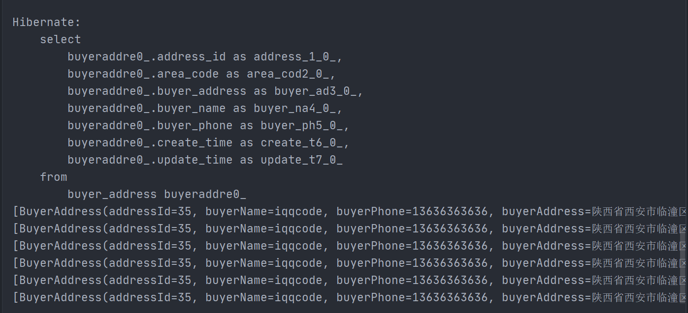
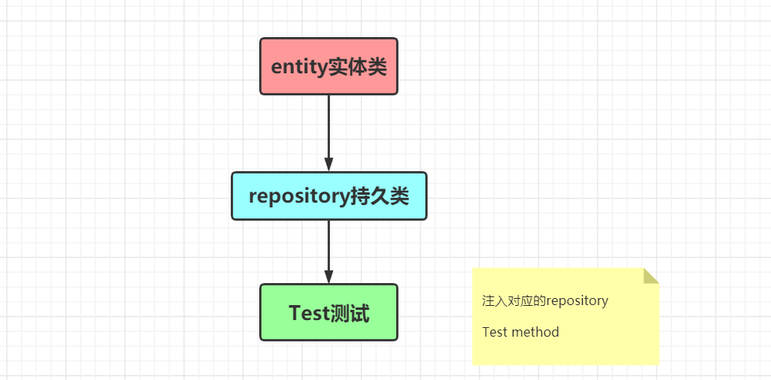

### 实体类构建

- `@Entity `该类是实体类，Spring会将该类与该数据表自动关联
- 实体类与表名称一直，不需要添加 `@Table`
- 成员变量名和表字段不一致，加`@Column`
- `@DynamicInsert`  
- `@DynamicUpdate `  
- `GeneratedValue` 主键自增长

**成员变量必须符合驼峰命名法**

```java
@Data
@Entity
@Table(name = "buyer_address")
@DynamicInsert
@DynamicUpdate
public class BuyerAddress {
    @Id
    @GeneratedValue(strategy = GenerationType.IDENTITY)
    private Integer addressId;
    private String buyerName;
    private String buyerPhone;
    private String buyerAddress;
    private String areaCode;
    private Date createTime;
    private Date updateTime;
}
```

### 添加持久化接口

编写**BuyerAddress**类的`repository`接口，继承Jpa提供的接口`JpaRepository`，不需要写具体的实现，即可完成持久化操作

```java
import org.springframework.data.jpa.repository.JpaRepository;

public interface BuyerAddressRepsitory extends JpaRepository<BuyerAddress,Integer> {
}
```

泛型

```java
JpaRepository<实体类名,主键类型>
```

#### JpaRepository接口

- 增删改查接口，常用


### 单元测试

**1. 注入实体类名** 

```java
@Autowired
private BuyerAddressRepsitory repsitory;
```

**2. 测试**

- 查询所有购买者物流地址

```java
@Test
void findAll(){
    List<BuyerAddress> list = repsitory.findAll();
    for (BuyerAddress buyerAddress : list) {
        System.out.println(buyerAddress);
    }
}
```

自动帮我们生成SQL语句并且返回查询结果：




### Jpa的通用性

Jap有通用性，只会生成类的通用方法，与具体业务相关的方法需要自己声明

比如所根据规格来查询手机，这是特定的业务方法，需要自己声明

`repository`下接口下声明方法

```java
public interface PhoneCategoryRepository extends JpaRepository<PhoneCategory,Integer> {
    //根据规格查询手机
    PhoneCategory findByCategoryType(Integer categoryType);
}
```

测试

```java
@SpringBootTest
public class PhoneCategoryRepositoryTest {
    @Autowired
    private PhoneCategoryRepository repository;

    @Test
    public void findAll() {
        List<PhoneCategory> list = repository.findAll();
        for (PhoneCategory category : list) {
            System.out.println(category);
        }
    }

    @Test
    public void findByCategoryType() {
        PhoneCategory byCategoryType = repository.findByCategoryType(1);
        System.out.println(byCategoryType);
    }
}
```

