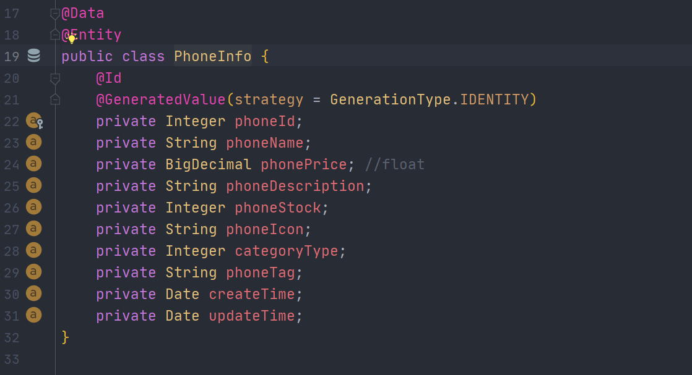
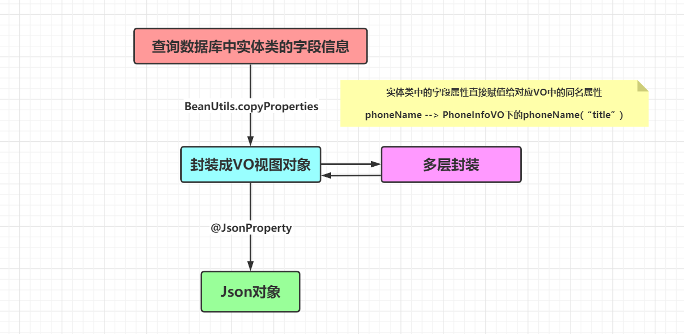
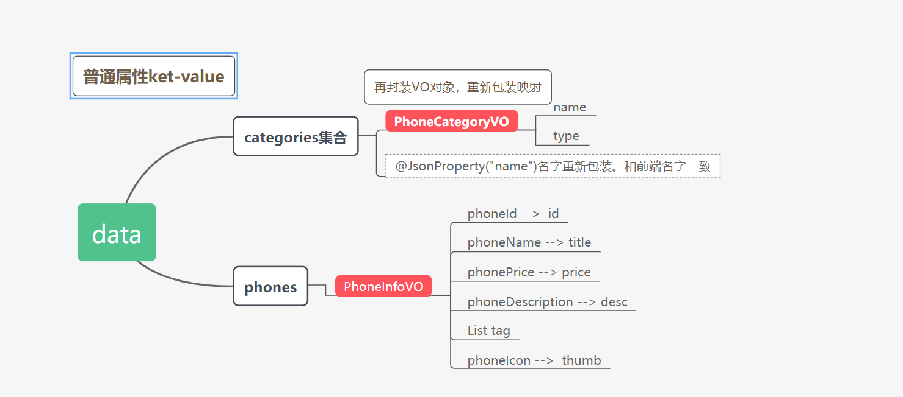
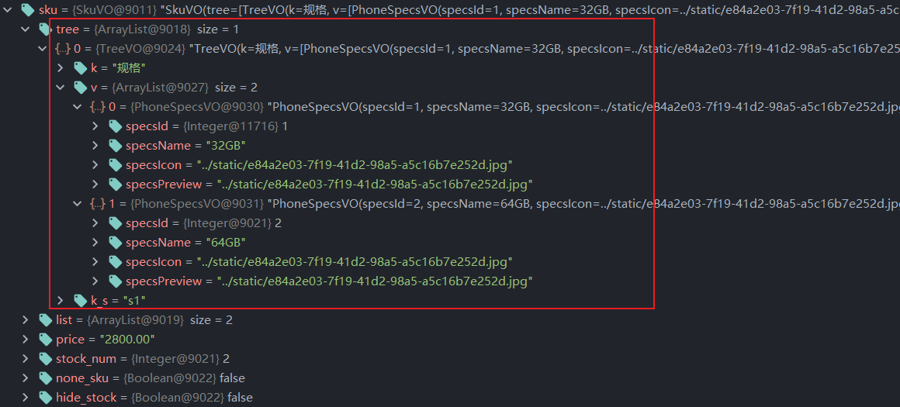
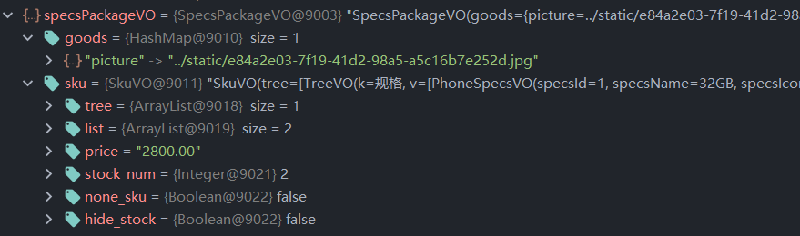

前端需要的数据：

后端的实体类

**后端定义的实体类，与前端需要的数据是不一致的。我们需要将实体类进行封装，组合成一个个VO视图对象，拼接乘前端需要的数据**

这个过程是：

- 将前端的`json`字符串进行拆分，拆分成一个个小的模块
- 后端将实体类封装成VO视图对象，组合成小的模块进行拼接

**上述data对象的封装层级**

**Debug下测试数据**

然后分别对

- **手机信息VO**
- **排行榜数据VO**
- **订单VO**
- **地址VO**

做映射和封装

