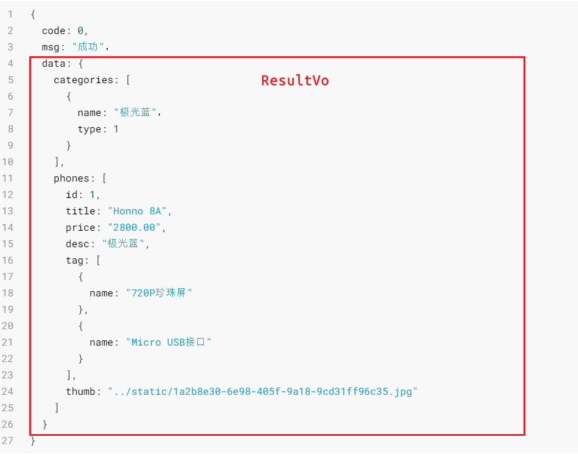
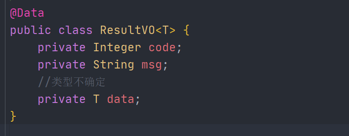
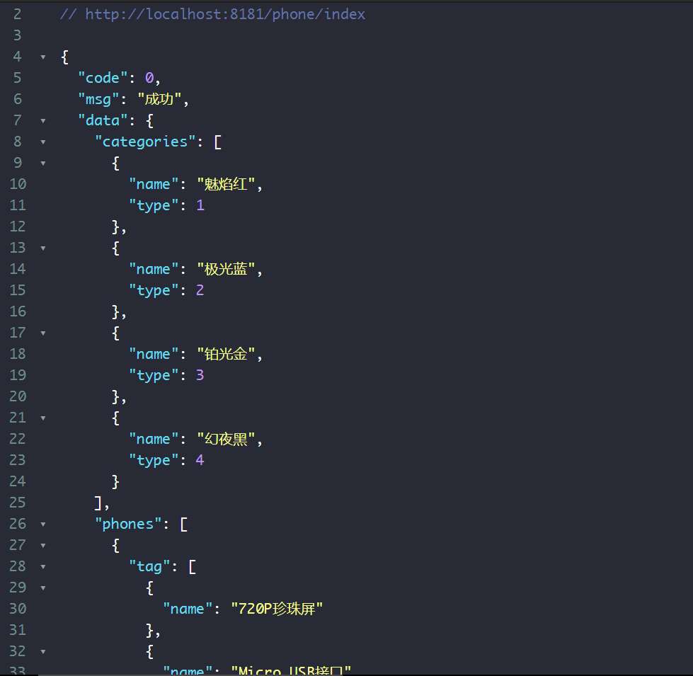

**视图层根据RESTful接口规范，直接返回Json数据即可**

**严格参照接口文档**



**首页视图**：返回给前端的三部分数据



首页视图

```java
@RestController //返回Json数据
@RequestMapping("/phone")
public class PhoneHandler {
    @Autowired
    private PhoneService phoneService;

    @GetMapping("/index")
    public ResultVO index() {
        return ResultVOUtil.success(phoneService.findDataVO());
    }

    @GetMapping("/findByCategoryType/{categoryType}")
    public ResultVO findByCategoryType(
            @PathVariable("categoryType") Integer categoryType){
        return ResultVOUtil.success(phoneService.findPhoneInfoVOByCategoryType(categoryType));
    }

    @GetMapping("/findSpecsByPhoneId/{phoneId}")
    public ResultVO findSpecsByPhoneId(
            @PathVariable("phoneId") Integer phoneId){
        return ResultVOUtil.success(phoneService.findSpecsByPhoneId(phoneId));
    }
}
```

测试数据是否正确：

`http://localhost:8181/phone/index`



