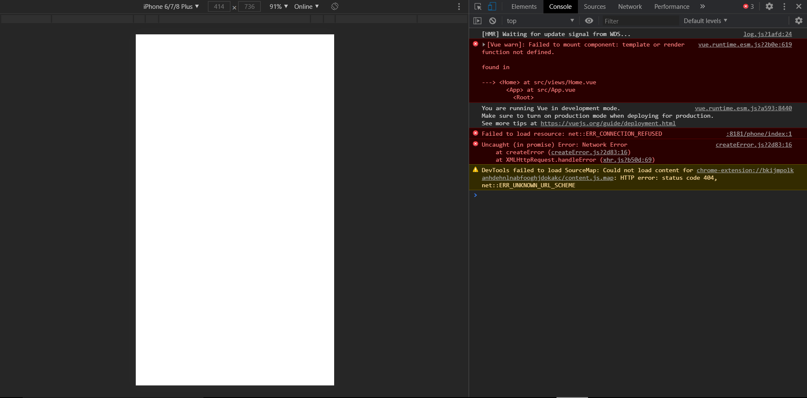
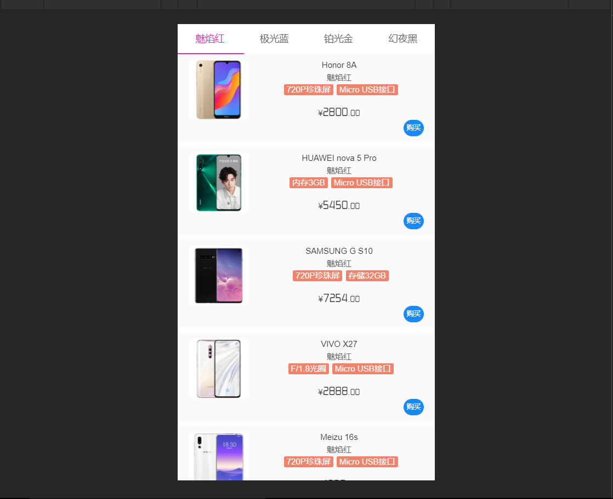
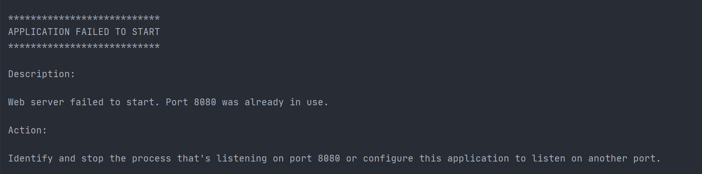
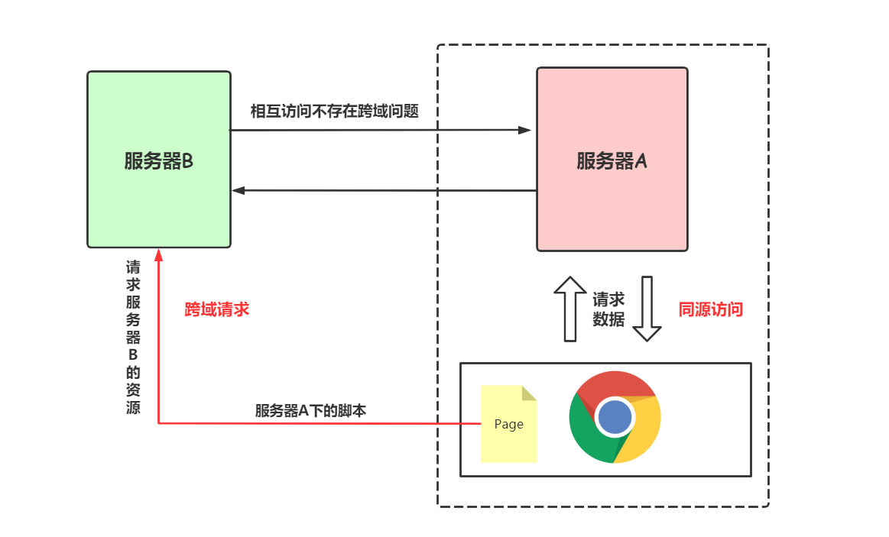
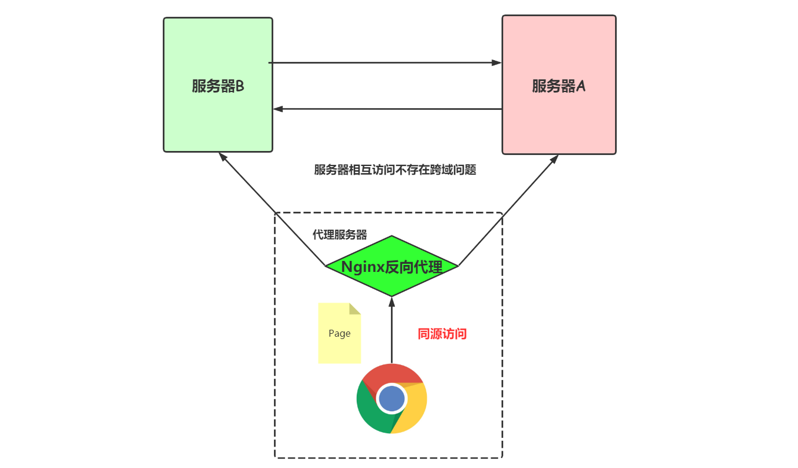

### 踩坑一：没配置

由于刚上手学习vue，虽然有一个全栈的梦，但是没有秃，实力不够。踩的第一个坑就是：

**环境搭建好后没导入组件**

虽然有假数据，但是`npm run serve`启动也是可以访问的到，但是一直是空白



在`main.js`中导入组件

为了防止出现这种情况，直接全局引入。相当于全部导入组件，不用再单独导入某一个组件的类库了

```js
import Vant from 'vant'
import 'vant/lib/index.css'

Vue.use(Vant)
```

数据出现



<br>

### 踩坑二：sku商品属性展示

对着文档，反反复复改了好多次，才改成。涉及到的属性太多了，只能一一排除不用的，然后再拼凑。

【问题思考】

- 针对很复杂的页面属性，先直接删除不用的，然后确定了使用的属性范围后，再逐步调整有用信息。

**sku 对象结构**

```js
sku: {
  // 所有sku规格类目与其值的从属关系，比如商品有颜色和尺码两大类规格，颜色下面又有红色和蓝色两个规格值。
  // 可以理解为一个商品可以有多个规格类目，一个规格类目下可以有多个规格值。
  tree: [
    {
      k: '颜色', // skuKeyName：规格类目名称
      k_s: 's1', // skuKeyStr：sku 组合列表（下方 list）中当前类目对应的 key 值，value 值会是从属于当前类目的一个规格值 id
      v: [
        {
          id: '1', // skuValueId：规格值 id
          name: '红色', // skuValueName：规格值名称
          imgUrl: 'https://img.yzcdn.cn/1.jpg', // 规格类目图片，只有第一个规格类目可以定义图片
          previewImgUrl: 'https://img.yzcdn.cn/1p.jpg', // 用于预览显示的规格类目图片
        },
        {
          id: '1',
          name: '蓝色',
          imgUrl: 'https://img.yzcdn.cn/2.jpg',
          previewImgUrl: 'https://img.yzcdn.cn/2p.jpg',
        }
      ],
      largeImageMode: true, //  是否展示大图模式
    }
  ],
  // 所有 sku 的组合列表，比如红色、M 码为一个 sku 组合，红色、S 码为另一个组合
  list: [
    {
      id: 2259, // skuId
      s1: '1', // 规格类目 k_s 为 s1 的对应规格值 id
      s2: '1', // 规格类目 k_s 为 s2 的对应规格值 id
      price: 100, // 价格（单位分）
      stock_num: 110 // 当前 sku 组合对应的库存
    }
  ],
  price: '1.00', // 默认价格（单位元）
  stock_num: 227, // 商品总库存
  collection_id: 2261, // 无规格商品 skuId 取 collection_id，否则取所选 sku 组合对应的 id
  none_sku: false, // 是否无规格商品
 
  hide_stock: false // 是否隐藏剩余库存
}
```


### 踩坑：跨域问题

> [跨域问题整理🔗](https://blog.csdn.net/weixin_43232955/article/details/108319431)

前后端都写完了，在进行前后端数据对接时，启动前端比如需要访问 `localhost:8080/phone/findall`，目的是和后端交互访问本地数据库，后端启动Tomcat一样用的8088端口。

端口没做修改，均采用默认端口。

但是由于前端`npm run dev server`占用了8080端口，所以Tomcat不能启动



> 保存信息提示该端口被占用，换一个没有被侦听的端口！

在`yml`中配置`8181`端口，然后，**<font color = red>跨域它来了</font>**



然后，又加了`CorsConfig`全局配置类，用CORS来解决跨域。

```java
package com.iqqcode.store.config;

import org.springframework.context.annotation.Configuration;
import org.springframework.web.servlet.config.annotation.CorsRegistry;
import org.springframework.web.servlet.config.annotation.WebMvcConfigurer;

/**
 * @Author: Mr.Q
 * @Date: 2020-08-03 07:58
 * @Description:解决前(8080)后(8181)端端口不一致的跨域问题
 */
@Configuration
public class CorsConfig implements WebMvcConfigurer {
    @Override
    public void addCorsMappings(CorsRegistry registry) {
        registry.addMapping("/**") // 所有的当前站点的请求地址，都支持跨域访问
                .allowedOrigins("*") // 所有的外部域都可跨域访问。 如果是localhost则很难配置，因为在跨域请求的时候，外部域的解析可能是localhost、127.0.0.1、主机名
                .allowedMethods("GET", "HEAD", "POST", "PUT", "DELETE", "OPTIONS") // 当前站点支持的跨域请求类型是什么
                .allowCredentials(true) // 是否支持跨域用户凭证
                .maxAge(3600) // 超时时长设置为1小时。 时间单位是秒。
                .allowedHeaders("*"); //获取所有请求头字段
    }
}
```


如果并发量大，考虑使用*Nginx*做反向代理

> nginx作为反向代理服务器，就是把Http请求转发到另一个或者一些服务器上。通过把本地一个url前缀映射到要跨域访问的web服务器上，就可以实现跨域访问。



> [Nginx 部署前后端分离项目，解决跨域问题](https://mp.weixin.qq.com/s?src=11&timestamp=1598858255&ver=2555&signature=3vr*PLQNOmJI6aT3zXWwJF9fuWEdA2kXoSfbFKYM7RRl0sSVqrCfFK1KYvRC1uLdGT3BQAWlzQlCW6A0NRv-0YreNnoiRGof5904sTgKIFWXEvWPII29twcO4fy9wOGF&new=1)

