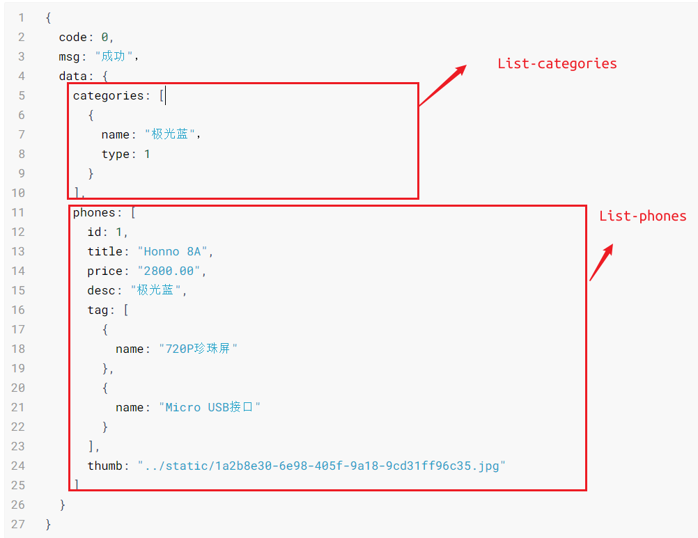
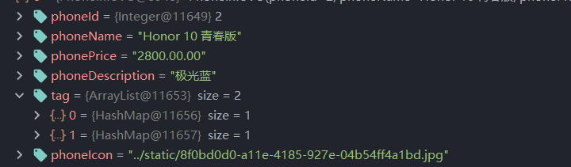
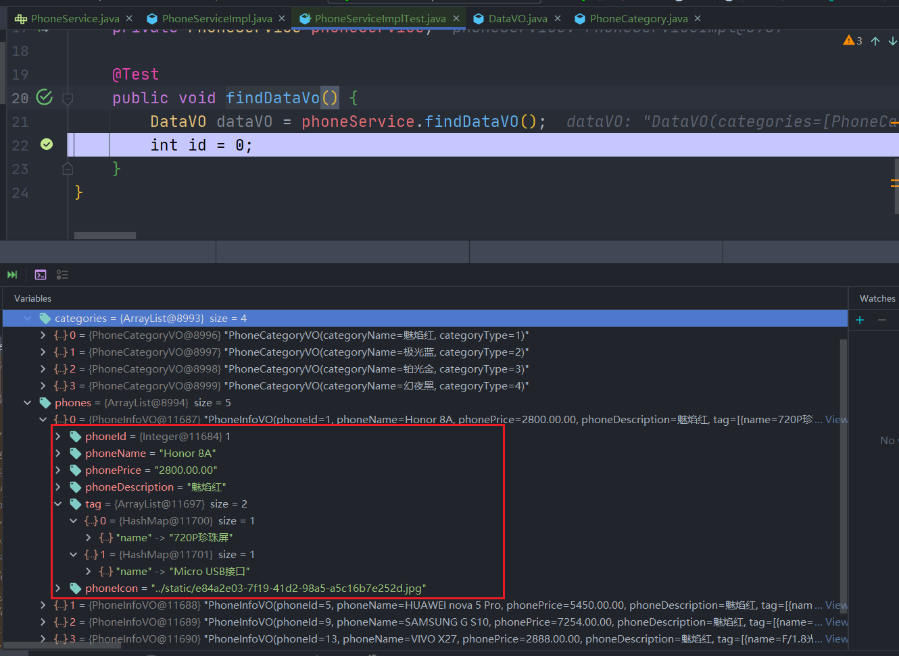

## 【问题思考总结】

1. 前后端对象对接的问题–VO视图对象


### 1. VO视图对象

> 根据前端页面的请求将数据封装传递 




`PhoneCategory`中有5个字段，但是categories仅需要2个，不符合前端请求的规范

严格安装文档，重现封装映射VO

```java
private List<PhoneCategoryVO> categories;

private List<PhoneInfoVO> phones;
```

`@JsonProperty`

**PhoneCategoryVO**转为json对象后，categoryName对应的json对象的名字。理解为二次命名



> 在Service层还是展示的java对象原有名字，在Controller返回为json时`JsonProperty`才做替换

```java
public class PhoneCategoryVO {
    @JsonProperty("name")
    private String categoryName;
    @JsonProperty("type")
    private Integer categoryType;
}
```


**PhoneService数据测试**

- dataVO



